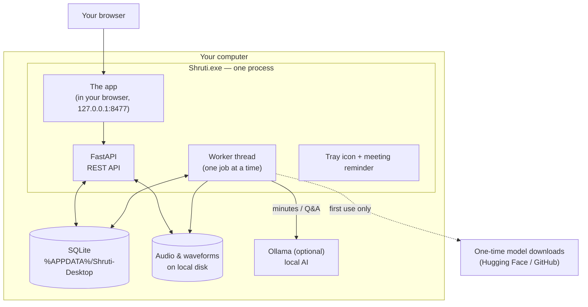
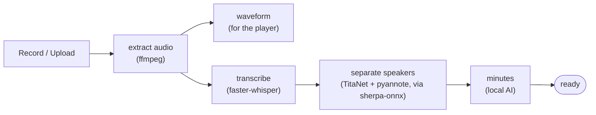

# How Shruti works

One process does everything: a FastAPI backend serves the app in your browser, a
worker thread processes recordings one job at a time, and SQLite stores it all.
PyInstaller freezes that into `Shruti.exe`. Nothing listens beyond your own
computer, and no meeting audio ever leaves it.

## What happens to a recording

Each arrow is a job in a queue — if one fails, the earlier results survive
(a transcript never disappears because minutes failed).

## Why a job queue in the database, and not Celery/Redis?

Because the queue is ~140 lines over the SQLite file we already have — with
retries, progress reporting, and crash recovery — while a broker would mean two
more services to install and monitor, for exactly one worker. Full reasoning:
[ADR-002](decisions/ADR-002-db-job-queue.md).
